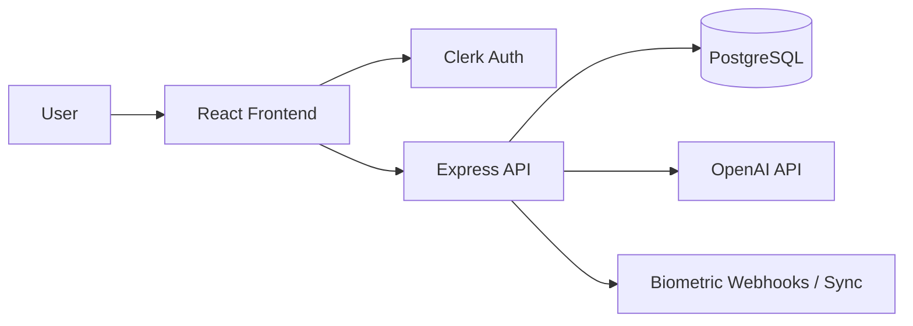

# architecture.md

````md
# Architecture

## High-level Architecture

Aura uses a PERN stack with Clerk for authentication and OpenAI for coaching. The frontend is a React app that talks to an Express API, which stores user and activity data in PostgreSQL.


````

## Tech Stack

- Frontend: React (JavaScript), Tailwind CSS.
- Backend: Node.js, Express (JavaScript).
- Database: PostgreSQL.
- Authentication: Clerk.
- AI: OpenAI API.
- Charts: Recharts or Chart.js.
- Validation: Zod or similar schema validation.
- Deployment: Assumption: separate frontend and API deployments with managed PostgreSQL.

## Folder Structure

## Folder Structure

Assumption: a monorepo with separate frontend and backend applications, using a feature-based architecture for the API.

```mermaid
flowchart TD
  Root --> Frontend[apps/web]
  Root --> Backend[apps/api]
  Root --> Shared[packages/shared]
  Root --> Docs[docs]

  Backend --> Modules[modules]
  Backend --> Middleware[middleware]
  Backend --> Config[config]

  Modules --> Dashboard[dashboard]
  Modules --> Energy[energy]
  Modules --> Interactions[interactions]
  Modules --> Coping[coping]
  Modules --> Analytics[analytics]
  Modules --> Coaching[coaching]
  Modules --> Biometrics[biometrics]

  Dashboard --> DashboardRoutes[routes]
  Dashboard --> DashboardControllers[controllers]
  Dashboard --> DashboardServices[services]

  Energy --> EnergyRoutes[routes]
  Energy --> EnergyControllers[controllers]
  Energy --> EnergyServices[services]

  Interactions --> InteractionRoutes[routes]
  Interactions --> InteractionControllers[controllers]
  Interactions --> InteractionServices[services]

  Coping --> CopingRoutes[routes]
  Coping --> CopingControllers[controllers]
  Coping --> CopingServices[services]

  Analytics --> AnalyticsRoutes[routes]
  Analytics --> AnalyticsControllers[controllers]
  Analytics --> AnalyticsServices[services]

  Coaching --> CoachingRoutes[routes]
  Coaching --> CoachingControllers[controllers]
  Coaching --> CoachingServices[services]

  Biometrics --> BiometricsRoutes[routes]
  Biometrics --> BiometricsControllers[controllers]
  Biometrics --> BiometricsServices[services]

  Frontend --> Components[components]
  Frontend --> Pages[pages]
  Frontend --> Hooks[hooks]
  Frontend --> Lib[lib]
```



### Backend Structure

```text
apps/api/
└── src/
    ├── modules/
    │   ├── dashboard/
    │   │   ├── routes/
    │   │   ├── controllers/
    │   │   └── services/
    │   ├── energy/
    │   │   ├── routes/
    │   │   ├── controllers/
    │   │   └── services/
    │   ├── interactions/
    │   │   ├── routes/
    │   │   ├── controllers/
    │   │   └── services/
    │   ├── coping/
    │   │   ├── routes/
    │   │   ├── controllers/
    │   │   └── services/
    │   ├── analytics/
    │   │   ├── routes/
    │   │   ├── controllers/
    │   │   └── services/
    │   ├── coaching/
    │   │   ├── routes/
    │   │   ├── controllers/
    │   │   └── services/
    │   └── biometrics/
    │       ├── routes/
    │       ├── controllers/
    │       └── services/
    │
    ├── middleware/
    ├── config/
    ├── app.js
    └── server.js
```

This keeps the API organized around Aura's core product features while avoiding unnecessary layers and folders.

## Database

Assumption: PostgreSQL stores users, energy logs, social interactions, biometric records, and AI insight history.

### Core Tables

- `users`
- `energy_logs`
- `social_interactions`
- `biometric_logs`
- `weekly_insights`

### Notes

- Use Clerk user ID as the external identity key.
- Enforce user scoping on every query.
- Encrypt sensitive fields at rest where supported by the deployment platform or database-level tooling.

## Authentication

- Clerk handles sign-in, sign-up, and session management.
- Express validates Clerk JWTs on protected routes.
- API routes must reject unauthenticated or invalid requests.

## API Design

Assumption: REST API under `/api/v1`.

### Key Endpoints

- `POST /api/v1/auth/sync`
- `POST /api/v1/logs/energy`
- `POST /api/v1/interactions`
- `GET /api/v1/analytics/dashboard`
- `POST /api/v1/ai/generate-script`
- `POST /api/v1/biometrics`

### API Principles

- Use consistent JSON response shapes.
- Return validation errors in a structured format.
- Keep read endpoints fast and cacheable where appropriate.
- Keep AI generation behind a service layer.

## Backend Services

- Energy scoring service.
- Burnout risk evaluation service.
- Analytics aggregation service.
- OpenAI coaching service.
- Biometrics ingestion service.
- Clerk webhook sync service.

## Frontend Architecture

- React pages for dashboard, logs, analytics, and coaching.
- Reusable form components for interaction logging.
- Chart components for trends and burnout risk.
- Mobile-first layout using Tailwind.

## State Management

Assumption: use local component state for forms and server-state fetching for dashboard data.

- Server state: React Query or equivalent.
- UI state: React state or lightweight store if needed.
- Avoid duplicating server data in client state.

## Third-party Services

- Clerk for auth.
- OpenAI for scripts and weekly insights.
- Wearable platform or webhook aggregator for biometrics sync.

## Deployment

Assumption:

- Frontend deployed separately from backend.
- Backend deployed as a Node service.
- PostgreSQL managed externally.
- Environment variables stored securely in the host platform.

## Environment Variables

Assumption:

- `DATABASE_URL`
- `CLERK_SECRET_KEY`
- `CLERK_PUBLISHABLE_KEY`
- `CLERK_WEBHOOK_SECRET`
- `OPENAI_API_KEY`
- `OPENAI_MODEL`
- `APP_BASE_URL`
- `API_BASE_URL`

## Security Considerations

- Validate Clerk tokens on every protected request.
- Verify Clerk webhooks using the webhook secret.
- Scope all queries by authenticated user.
- Encrypt sensitive records at rest.
- Never expose raw AI prompts containing unnecessary personal data.
- Rate limit AI and ingestion endpoints.

## Scalability Notes

- Index queries by `clerk_id`, date, and interaction timestamp.
- Precompute dashboard aggregates where useful.
- Keep AI generation async if response time becomes slow.
- Add background jobs for weekly insights and wearable sync if volume increases.

```

***
```
