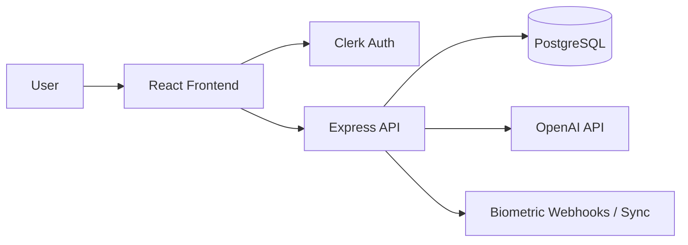
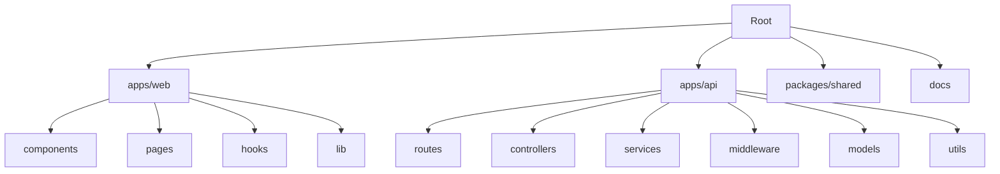

# If you're using AI coding agents (Claude Code, Codex, Cursor, Gemini CLI, etc.), don't ask it to "generate documentation." Instead, make it act as a technical architect that extracts only the information needed to build the project.

A stronger prompt is:
AI Documentation Generator Prompt
You are a senior software architect and technical writer.
Your task is to analyze the provided Product Requirements Document (PRD) and generate a clean developer documentation folder.
Goal
Convert the PRD into implementation-ready documents.
Do NOT copy the PRD word for word.
Remove:
brainstorming
duplicate information
explanations for non-technical readers
marketing language
unnecessary descriptions
repeated requirements
anything unrelated to implementation
Keep only information that developers and AI coding agents need.
If the PRD is missing information, explicitly write "Assumption" instead of inventing details.
Output Structure
Create the following Markdown files.

1. PRD.md
   A cleaned version of the original PRD.
   Include only:
   Project Overview
   Problem Statement
   Goals
   Target Users
   Core Features
   Functional Requirements
   Non-functional Requirements
   User Flow
   Success Metrics
   Scope
   Out of Scope
   Remove everything else.
2. architecture.md
   Describe the system architecture.
   Include:
   High-level architecture
   Tech stack
   Folder structure
   Database
   Authentication
   API design
   Backend services
   Frontend architecture
   State management
   Third-party services
   Deployment
   Environment variables
   Security considerations
   Scalability notes
   Use Mermaid diagrams whenever useful.
3. agent.md
   This file will be used by AI coding agents.
   Include:
   Project Context
   Explain the application in a few paragraphs.
   Coding Rules
   Examples:
   Never modify database schema unless instructed.
   Always create migrations.
   Keep API responses consistent.
   Use modern JavaScript (ES2022+) and enforce strict linting rules.
   Prefer reusable components.
   Never duplicate business logic.
   Code Style
   Include conventions for:
   naming
   folders
   imports
   error handling
   validation
   logging
   Development Workflow
   Describe:
   how to add features
   how to modify APIs
   testing expectations
   pull request expectations
   AI Constraints
   Specify what an AI assistant must never do without confirmation.
4. decisions.md
   Create an Architecture Decision Record (ADR).
   For every important technical decision include:
   Decision
   Status
   Context
   Alternatives Considered
   Reason
   Consequences
   Example topics:
   Why PostgreSQL
   Why Clerk
   Why React
   Why Express
   Why REST
   Why JWT
   Why JavaScript
   Why Neon
   Why OpenAI
   If the PRD doesn't specify one, mark it as an assumption.
5. tasks.md
   Break the project into implementation tasks.
   Structure:
   Epic
   Feature
   Task
   Subtask
   Acceptance Criteria
   Dependencies
   Estimated Complexity
   Priority
   Status (Todo)
   Order tasks from lowest dependency to highest.
   Tasks should be small enough to complete in one coding session.
   Formatting Rules
   Output valid Markdown.
   Use headings consistently.
   Use tables where appropriate.
   Use Mermaid diagrams for architecture and workflows.
   Remove duplicated information.
   Do not include placeholders unless information is missing.
   Clearly label assumptions.
   Optimize the documents for AI coding assistants rather than human readers.
   The output should be production-quality documentation that can replace the original PRD for software implementation.
   This prompt produces much cleaner results because it changes the AI's role from "summarize this PRD" to "produce implementation-ready documentation." It also forces the model to remove redundant content, separate concerns into dedicated files, record assumptions instead of hallucinating details, and organize tasks into an actionable implementation plan. This structure works well with AI coding agents because each file has a single, well-defined purpose.

Below is a cleaned, implementation-ready documentation set extracted from the PRD. I kept only developer-facing content, turned ambiguous parts into explicit assumptions, and organized it for AI coding agents.

---

# PRD.md

## Project Overview

Aura is a wellness application for tracking emotional and social energy, predicting burnout risk, and generating personalized coaching for boundaries and recovery.

## Problem Statement

Users need a structured way to measure energy drain from daily interactions, identify burnout patterns early, and get practical guidance for setting boundaries and recovering their energy.

## Goals

- Track daily energy levels and social interactions.
- Predict burnout risk from repeated high-drain behavior or multi-day energy streaks.
- Generate personalized boundary-setting and wellness guidance using user-defined coping strategies.
- Provide analytics that correlate mood, energy, sleep, and relationship patterns.

## Target Users

- Individuals managing burnout, social fatigue, or emotional overload.
- Users who want to track how relationships affect their energy.
- Users who want AI-generated support for boundaries and recovery planning.

## Core Features

- Daily energy dashboard with a battery meter from 0 to 100.
- Social interaction logging with duration and drain score.
- Burnout risk detection based on consecutive high-drain events and multi-day low-battery streaks.
- Personal Coping Menu for user-curated recovery activities.
- Adaptive Recovery Reminders offering 2–3 low-friction choices when limits are hit.
- Coping mechanism feedback loop to track and rank activity effectiveness over time.
- Analytics for mood-to-energy and relationship impact.
- Boundary message templates and AI-generated scripts.
- Weekly AI-generated wellness insights.
- Wearable biometric data ingestion.

## Functional Requirements

- Users can log event type, duration, and perceived drain score.
- Users can log daily mood and current battery level.
- The system recalculates energy and burnout indicators in real-time after new logs.
- The system flags high burnout risk after 3 consecutive high-drain events without recovery or when a user reaches a 3-day low-battery streak.
- Users can input and manage a Personal Coping Menu categorized by effort level (low, medium, high) during onboarding and within profile settings.
- When an event trigger occurs (drain score <= -3, battery <= 30%, or a 3-streak limit), the system surfaces a Recovery Reminder modal with a curated list of 2–3 coping choices tailored to their current energy level.
- Users can rate the effectiveness of a selected coping activity ("Did this help?"), updating the activity's success score to prioritize high-performing recovery options in future triggers.
- The dashboard shows mood-to-energy charts over weekly and monthly periods.
- The dashboard shows a burnout risk dial with green, yellow, and red states.
- Users can categorize interactions by relationship type and add an optional name/label.
- The analytics view aggregates life-giving connections and high-drain dynamics.
- Users can request AI-generated boundary messages.
- The backend generates weekly coaching summaries using user metrics.
- The system accepts biometric data for sleep duration, resting heart rate, and HRV through an API endpoint.
- All authenticated app endpoints require Clerk-based access control.

## Non-functional Requirements

- Sensitive data must be encrypted at rest in PostgreSQL.
- Users must not be able to access another user’s records.
- Dashboard-related API requests should respond in under 250ms.
- OpenAI failures must fall back to local templates without breaking the UI.
- The UI must be mobile responsive.

---

# architecture.md

````md
# Architecture

## High-level Architecture

Aura uses a PERN stack with Clerk for authentication and OpenAI for coaching. The frontend is a React app that talks to an Express API, which stores user and activity data in PostgreSQL.


````

## Tech Stack

- Frontend: React (JavaScript), Tailwind CSS.
- Backend: Node.js, Express (JavaScript).
- Database: PostgreSQL.
- Authentication: Clerk.
- AI: OpenAI API.
- Charts: Recharts or Chart.js.
- Validation: Zod or similar schema validation.
- Deployment: Assumption: separate frontend and API deployments with managed PostgreSQL.

## Folder Structure

Assumption: a monorepo or single repo with separated app folders.



## Database

Assumption: PostgreSQL stores users, energy logs, social interactions, biometric records, and AI insight history.

### Core Tables

- `users`
- `energy_logs`
- `social_interactions`
- `biometric_logs`
- `weekly_insights`

### Notes

- Use Clerk user ID as the external identity key.
- Enforce user scoping on every query.
- Encrypt sensitive fields at rest where supported by the deployment platform or database-level tooling.

## Authentication

- Clerk handles sign-in, sign-up, and session management.
- Express validates Clerk JWTs on protected routes.
- API routes must reject unauthenticated or invalid requests.

## API Design

Assumption: REST API under `/api/v1`.

### Key Endpoints

- `POST /api/v1/auth/sync`
- `POST /api/v1/logs/energy`
- `POST /api/v1/interactions`
- `GET /api/v1/analytics/dashboard`
- `POST /api/v1/ai/generate-script`
- `POST /api/v1/biometrics`

### API Principles

- Use consistent JSON response shapes.
- Return validation errors in a structured format.
- Keep read endpoints fast and cacheable where appropriate.
- Keep AI generation behind a service layer.

## Backend Services

- Energy scoring service.
- Burnout risk evaluation service.
- Analytics aggregation service.
- OpenAI coaching service.
- Biometrics ingestion service.
- Clerk webhook sync service.

## Frontend Architecture

- React pages for dashboard, logs, analytics, and coaching.
- Reusable form components for interaction logging.
- Chart components for trends and burnout risk.
- Mobile-first layout using Tailwind.

## State Management

Assumption: use local component state for forms and server-state fetching for dashboard data.

- Server state: React Query or equivalent.
- UI state: React state or lightweight store if needed.
- Avoid duplicating server data in client state.

## Third-party Services

- Clerk for auth.
- OpenAI for scripts and weekly insights.
- Wearable platform or webhook aggregator for biometrics sync.

## Deployment

Assumption:

- Frontend deployed separately from backend.
- Backend deployed as a Node service.
- PostgreSQL managed externally.
- Environment variables stored securely in the host platform.

## Environment Variables

Assumption:

- `DATABASE_URL`
- `CLERK_SECRET_KEY`
- `CLERK_PUBLISHABLE_KEY`
- `CLERK_WEBHOOK_SECRET`
- `OPENAI_API_KEY`
- `OPENAI_MODEL`
- `APP_BASE_URL`
- `API_BASE_URL`

## Security Considerations

- Validate Clerk tokens on every protected request.
- Verify Clerk webhooks using the webhook secret.
- Scope all queries by authenticated user.
- Encrypt sensitive records at rest.
- Never expose raw AI prompts containing unnecessary personal data.
- Rate limit AI and ingestion endpoints.

## Scalability Notes

- Index queries by `clerk_id`, date, and interaction timestamp.
- Precompute dashboard aggregates where useful.
- Keep AI generation async if response time becomes slow.
- Add background jobs for weekly insights and wearable sync if volume increases.

````

***

# agent.md

```md
# Agent Instructions

## Project Context
Aura is a wellness tracking application focused on emotional and social energy. Users log daily energy levels, mood, and interactions, and the system uses that data to show trends, predict burnout risk, and generate boundary-setting guidance.

The app has three main product layers: manual tracking, analytics and predictions, and AI-generated coaching. It also supports biometric imports from wearables. The system must feel lightweight, mobile-first, and safe for sensitive personal data.

## Coding Rules
- Never modify database schema unless explicitly instructed.
- Always create migrations for schema changes.
- Keep API response shapes consistent.
- Use modern JavaScript (ES2022+) and enforce strict linting rules.
- Prefer reusable components over one-off UI code.
- Never duplicate business logic across routes, services, and UI.
- Keep user-scoped data access enforced in every layer.
- Do not introduce new third-party services without approval.

## Code Style
### Naming
- Use `camelCase` for variables and functions.
- Use `PascalCase` for components, classes, and types.
- Use descriptive names for services and route handlers.
- Use plural names for collections and single names for entities.

### Folders
- Keep route handlers thin.
- Put business logic in services.
- Put validation schemas in dedicated schema files.
- Put shared types in a common package or shared module.

### Imports
- Prefer absolute imports if configured.
- Group external imports before internal imports.
- Remove unused imports immediately.

### Error Handling
- Return structured errors with stable error codes.
- Never swallow backend errors silently.
- Convert third-party failures into safe fallback responses.
- Handle OpenAI timeouts and rate limits gracefully.

### Validation
- Validate all request bodies, params, and query strings.
- Reject malformed or missing user input early.
- Use shared schemas for API inputs and outputs.

### Logging
- Log operational events, not sensitive personal content.
- Redact secrets, tokens, and personal data.
- Include request IDs or trace IDs when available.

## Development Workflow
### Adding Features
1. Define the data model change if needed.
2. Add or update validation schemas.
3. Implement the service logic.
4. Add the API route or UI component.
5. Add tests for happy path and failure path.
6. Update documentation if behavior changes.

### Modifying APIs
- Keep backward compatibility unless breaking changes are requested.
- Update request and response schemas together.
- Protect all user-specific endpoints with auth middleware.
- Add integration tests for auth and user scoping.

### Testing Expectations
- Write unit tests for business logic.
- Write integration tests for API endpoints.
- Test auth failure cases.
- Test fallback behavior for OpenAI outages.
- Test that a user cannot read another user’s data.

### Pull Request Expectations
- Keep changes small and focused.
- Include migrations when schema changes.
- Include tests for new behavior.
- Document any assumption introduced by the implementation.

## AI Constraints
An AI assistant must never:
- Change the auth provider without confirmation.
- Remove user scoping or access checks.
- Expose raw secrets, API keys, or webhook secrets.
- Rewrite database entities without approval.
- Replace fallback logic with hard failures.
- Send unnecessary personal data to external AI services.
- Add new features that alter core product scope without confirmation.
````

---

# decisions.md

```md
# Architecture Decisions

## 1. PostgreSQL for persistence

- Status: Assumption
- Context: The PRD specifies PostgreSQL as part of the PERN stack.
- Alternatives Considered: MySQL, MongoDB, SQLite.
- Reason: PostgreSQL fits relational user, log, and analytics data well.
- Consequences: Strong relational integrity and query flexibility; requires schema management.

## 2. Express for backend API

- Status: Assumption
- Context: The PRD specifies Express.
- Alternatives Considered: Fastify, NestJS, Next.js API routes.
- Reason: Express is simple, widely supported, and fits a REST API.
- Consequences: More manual structure than opinionated frameworks.

## 3. React for frontend

- Status: Assumption
- Context: The PRD specifies React.
- Alternatives Considered: Vue, Svelte, Next.js.
- Reason: React supports reusable UI components and chart-heavy dashboards.
- Consequences: Requires explicit architecture choices for data fetching and state.

## 4. Clerk for authentication

- Status: Confirmed
- Context: The PRD requires Clerk for user auth and token validation.
- Alternatives Considered: Auth0, custom auth, Firebase Auth.
- Reason: Outsourced auth reduces implementation burden and supports secure session handling.
- Consequences: Dependency on a third-party identity provider and webhook sync.

## 5. REST API design

- Status: Assumption
- Context: The PRD defines REST endpoints.
- Alternatives Considered: GraphQL, tRPC, RPC-style APIs.
- Reason: REST is straightforward for mobile-friendly app flows and webhook integrations.
- Consequences: Multiple endpoints may be needed for composite dashboard views.

## 6. JWT-based request validation

- Status: Confirmed
- Context: The PRD requires Clerk Node middleware to validate JWT Bearer tokens.
- Alternatives Considered: Session cookies only, API keys.
- Reason: JWT validation is compatible with protected API requests.
- Consequences: Middleware must be enforced consistently on all protected routes.

## 7. OpenAI for coaching

- Status: Confirmed
- Context: The PRD requires GPT-4o-based generation for scripts and weekly insights.
- Alternatives Considered: Rule-based templates only, another LLM provider.
- Reason: The product needs personalized, context-aware coaching text.
- Consequences: External API dependency and fallback handling are required.

## 8. Rule-based burnout detection

- Status: Confirmed
- Context: The PRD specifies a backend rule for high burnout risk.
- Alternatives Considered: ML classifier, purely manual interpretation.
- Reason: A deterministic rule is easier to implement and explain.
- Consequences: The result is simple but less adaptive than learned models.

## 9. Mobile-first Tailwind UI

- Status: Confirmed
- Context: The PRD specifies Tailwind CSS and mobile-first design.
- Alternatives Considered: CSS Modules, styled-components.
- Reason: Tailwind speeds up responsive UI development.
- Consequences: UI consistency depends on design discipline.

## 10. Wearable data via ingestion endpoint

- Status: Confirmed
- Context: The PRD defines a secure biometrics endpoint.
- Alternatives Considered: Direct SDK integrations only, manual import.
- Reason: A REST ingestion endpoint is flexible for webhooks and sync jobs.
- Consequences: Input validation and source trust must be carefully handled.

## 11. Data encryption at rest

- Status: Confirmed
- Context: The PRD requires encryption at rest for sensitive data.
- Alternatives Considered: Application-layer encryption only, no extra encryption.
- Reason: Sensitive wellness data should be protected in storage.
- Consequences: Key management and deployment configuration become more important.

## 12. Weekly AI insights job

- Status: Assumption
- Context: The PRD says weekly insights run every Sunday.
- Alternatives Considered: On-demand generation, daily generation.
- Reason: Weekly cadence fits the stated requirement and reduces noise.
- Consequences: Requires scheduled background execution.
```

---

# tasks.md

````md
# Implementation Tasks

| Epic       | Feature               | Task                                       | Subtask                                            | Acceptance Criteria                               | Dependencies                | Estimated Complexity | Priority | Status |
| ---------- | --------------------- | ------------------------------------------ | -------------------------------------------------- | ------------------------------------------------- | --------------------------- | -------------------- | -------- | ------ |
| Foundation | Project setup         | Initialize repository structure            | Set up frontend, backend, shared, and docs folders | Repo boots with clear separation of concerns      | None                        | Small                | High     | Todo   |
| Foundation | Tooling               | Configure JavaScript linting and standards | Add ESLint/Prettier config and linting rules       | JavaScript linting passes in CI                   | Repository structure        | Small                | High     | Todo   |
| Foundation | Tooling               | Add environment config handling            | Define validated env schema                        | App fails fast on missing env vars                | Tooling setup               | Small                | High     | Todo   |
| Foundation | Auth                  | Integrate Clerk on frontend                | Add sign-in and sign-up UI                         | Users can authenticate with Clerk                 | Project setup               | Medium               | High     | Todo   |
| Foundation | Auth                  | Integrate Clerk on backend                 | Add JWT validation middleware                      | Protected endpoints reject invalid tokens         | Auth setup                  | Medium               | High     | Todo   |
| Foundation | Auth                  | Implement Clerk webhook sync               | Create `/api/v1/auth/sync` handler                 | Clerk user data is stored in Postgres             | Backend auth                | Medium               | High     | Todo   |
| Data model | Schema                | Create users table                         | Add migration and model                            | Users are persisted with Clerk ID                 | Webhook sync                | Small                | High     | Todo   |
| Data model | Schema                | Create energy logs table                   | Add migration and model                            | Daily energy records can be saved                 | Users table                 | Small                | High     | Todo   |
| Data model | Schema                | Create social interactions table           | Add migration and model                            | Interaction records can be saved                  | Users table                 | Small                | High     | Todo   |
| Data model | Schema                | Add biometric logs table                   | Add migration and model                            | Wearable data can be stored                       | Users table                 | Small                | Medium   | Todo   |
| Data model | Schema                | Add weekly insights table                  | Add migration and model                            | AI summaries can be persisted                     | Users table                 | Small                | Medium   | Todo   |
| Backend    | Energy tracking       | Implement energy log API                   | Add validation and persistence                     | Daily energy logs save and return consistent JSON | Energy schema               | Medium               | High     | Todo   |
| Backend    | Social logging        | Implement interaction log API              | Add duration, category, and drain fields           | Social logs save correctly                        | Social schema               | Medium               | High     | Todo   |
| Backend    | Prediction            | Implement burnout rule engine              | Detect 3 consecutive high-drain events             | Risk flag appears deterministically               | Interaction API             | Medium               | High     | Todo   |
| Backend    | Recovery              | Implement quiet-time prompt logic          | Trigger prompt at drain <= -3                      | UI receives prompt condition from API             | Prediction engine           | Small                | Medium   | Todo   |
| Backend    | Analytics             | Build dashboard aggregation service        | Compute mood-energy trends and risk scores         | Dashboard endpoint returns all required metrics   | Energy and interaction data | Medium               | High     | Todo   |
| Backend    | Analytics             | Implement analytics API endpoint           | Serve consolidated dashboard data                  | Dashboard loads from one endpoint                 | Aggregation service         | Medium               | High     | Todo   |
| Frontend   | Dashboard             | Build battery meter component              | Render 0–100 visual indicator                      | Battery meter updates from server data            | Analytics API               | Medium               | High     | Todo   |
| Frontend   | Dashboard             | Build burnout risk dial                    | Show green/yellow/red states                       | Risk state matches backend score                  | Analytics API               | Small                | High     | Todo   |
| Frontend   | Logging               | Build interaction entry form               | Add duration slider and drain input                | Users can submit interaction logs quickly         | Auth, interaction API       | Medium               | High     | Todo   |
| Frontend   | Logging               | Build energy entry form                    | Add daily mood and battery input                   | Users can submit daily logs                       | Auth, energy API            | Medium               | High     | Todo   |
| Frontend   | Analytics             | Build charts for mood and energy           | Integrate chart library                            | Weekly/monthly trends render correctly            | Analytics API               | Medium               | High     | Todo   |
| Frontend   | Relationship insights | Build relationship category UI             | Add category dropdown and optional label           | Logs capture relationship context                 | Interaction form            | Small                | Medium   | Todo   |

|
<span style="display:none">[^1]</span>

<div align="center">⁂</div>

[^1]: prd-1.md```
````
